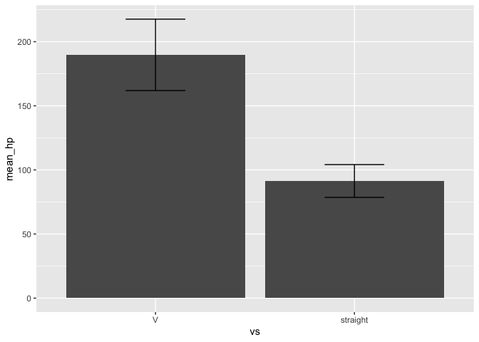

R Markdown Analysis Example
================

<!-- github_document produces a github-friendly markdown file -->

## Setup

``` r
library(tidyverse)
source("../R/ex_std_error.R")
```

Specify which data we will import and use:

``` r
data_path <- "../data/raw/ex_mtcars.csv"
```

## Part 1: Tidy data

We’ll do a short analysis using the `mtcars` dataset. After loading the
data, we’ll convert `vs` and `am` (which encode engine and transmission
types) to factors, since they are really dichotomous variables, not
numbers.

``` r
tidy_mtcars_pipe <- function(df) {
  df %>% 
    recode_vs() %>% 
    recode_am()
}
```

``` r
recode_vs <- function(df) {
  df %>% 
    mutate(vs = factor(vs)) %>% 
    mutate(vs = fct_recode(vs, `V` = "0", `straight` = "1"))
}

recode_am <- function(df) {
  df %>%
    mutate(am = factor(am)) %>% 
    mutate(am = fct_recode(am, `auto` = "0", `man` = "1"))
}
```

Run the pipeline:

``` r
ex_mtcars <- read_csv(data_path)

better_mtcars <-
  ex_mtcars %>% 
  tidy_mtcars_pipe()

better_mtcars %>% 
  saveRDS("../data/working/ex_better_mtcars.rds")
```

## Part 2: Summary statistics and plots

Now we investigate the relationship between engine type `vs` and
horsepower `hp`.

We calculate mean and standard error, then plot them:

``` r
plot_pipe <- function(df) {
  df %>% 
    vs_hp_mean_se() %>% 
    vs_hp_plot()
}
```

``` r
# `ex_std_error()` is a helper function in another script
vs_hp_mean_se <- function(df) {
  df %>% 
    group_by(vs) %>% 
    summarize(mean_hp = mean(hp), std_err_hp = ex_std_error(hp))
}

# a boring and poorly-designed plot
vs_hp_plot <- function(df) {
  df %>% 
    ggplot(aes(
      x = vs,
      y = mean_hp,
      ymin = mean_hp-(1.96*std_err_hp),
      ymax = mean_hp+(1.96*std_err_hp)
    )) +
    geom_col() +
    geom_errorbar(width = 0.3)
}
```

Plot the association between engine type and horsepower:

``` r
better_mtcars %>% 
  plot_pipe()
```

<!-- -->

Save the summary dataset as example output:

``` r
better_mtcars %>% 
  vs_hp_mean_se() %>% 
  saveRDS("../output/ex_engine_hp.rds")
```

## Testing

Testing is easy with `testthat::test_file`:

``` r
library(testthat)

test_file("../tests/ex_test_mtcars.R")
```

    ✔ |  OK F W S | Context
    ⠏ |   0       | ex_test_mtcars✔ |   2       | ex_test_mtcars
    
    ══ Results ═════════════════════════════════════════════════════════════════════
    OK:       2
    Failed:   0
    Warnings: 0
    Skipped:  0

Or `assertr` for nice data verification options:

``` r
library(assertr)

better_mtcars %>% 
  verify(is.logical(vs), error_fun = error_append) %>% # vs is a factor
  verify(nrow(.) == 31, error_fun = error_return)      # mtcars has 32 rows
```

    [[1]]
    verification [is.logical(vs)] failed! (1 failure)
    
        verb redux_fn      predicate column index value
    1 verify       NA is.logical(vs)     NA     1    NA
    
    [[2]]
    verification [nrow(.) == 31] failed! (1 failure)
    
        verb redux_fn     predicate column index value
    1 verify       NA nrow(.) == 31     NA     1    NA
